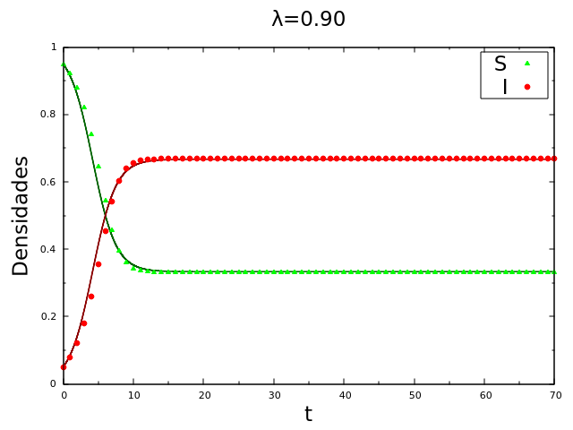

# Epidemiological Models

# SIS Model

The Susceptible-Infected-Susceptible (SIS) model, along with its various adaptations (e.g., accounting for mortality rates, population density changes, birth rates, and vaccination-based immunization), serves as a framework for describing scenarios in which susceptible individuals become infected and then self-immunize after a certain period, reverting back to a susceptible state. For more information on different SIS model variations, refer to relevant resources.

This model considers a uniform and homogeneous population where individuals are randomly distributed and classified as either Susceptible $(S)$ or Infected $(I)$. It assumes that any disease affecting the population follows the same dynamics:

1. $S+I=1$: The total population $N$ remains constant, allowing for the assumption that mortality and birth rates fluctuate in a manner that maintains this constancy. In this context, the epidemic can be observed over a brief period. Here, $S=n_s/N$ and $I=n_i/N$, where $n_s$ and $n_i$ represent the number of susceptible and infected individuals, respectively, and $N=n_i+n_s$. This approach focuses solely on population densities.

2. $S\overset{\lambda}{\Longrightarrow}I$: Susceptible individuals transition to the infected state with a probability of $\lambda$ per unit of time following contact with another infected individual. The rate $\lambda$ reflects a population's predisposition to an epidemic.

    2. For this process to unfold, a susceptible individual (probability $S$), an infected individual (probability $I$), and successful contagion (probability per unit of time $\lambda$) must be present. Therefore, the probability of a susceptible individual becoming infected after contact is given by $P_{S\to I}=\lambda SI$.

3. $I\overset{\alpha}{\Longrightarrow}S$: Infected individuals spontaneously revert to the susceptible state with a probability of $\alpha$ at each point in time. The factor $\alpha$ can be interpreted as an intrinsic recovery mechanism within the population.
      
      3. This process requires the presence of an infected individual (probability $I$) and their successful recovery (probability per unit of time $\alpha$). The probability of an infected individual spontaneously transitioning back to a susceptible state is thus $P_{S\to I}=\alpha I$.

To ilustrate this model, consider the following diagram:

The dynamics of the SIS model can be expressed using a set of coupled ordinary differential equations (ODEs), which represent the rates of change of susceptible and infected populations over time:

$$
\begin{align}
{\frac{dS}{dt}}&=-{\lambda}SI+{\alpha}I ,\\
{\frac{dI}{dt}}&={\lambda}SI-{\alpha}I 
\end{align}
$$

These equations provide a physical understanding of the system's behavior:

1. The rate of change of the susceptible population over time, $\frac{dS}{dt}$, depends on two competing processes:

    1. Susceptible individuals becoming infected, which decreases the susceptible population. This is represented by the term $-{\lambda}SI$.

    2. Infected individuals recovering and reverting to a susceptible state, which increases the susceptible population. This is represented by the term ${\alpha}I$.

2. The rate of change of the infected population over time, $\frac{dI}{dt}$, is also governed by two competing processes:

    1. Susceptible individuals becoming infected, which increases the infected population. This is represented by the term ${\lambda}SI$.

    2. Infected individuals recovering and reverting to a susceptible state, which decreases the infected population. This is represented by the term $-{\alpha}I$.

These coupled ODEs capture the continuous interplay between the susceptible and infected populations within the SIS model, providing a mathematical representation of the epidemic's progression.

## Results

  
  

Temporal evolution of infected and susceptible agent densities for the parameters $\lambda=0.25$, $\lambda=0.50$, and $\lambda=0.90$ with $\alpha=0.30$ fixed, showing an absorbing phase ($\lambda < \alpha$) at $\lambda=0.25$ and an active phase ($\lambda > \alpha$) at $\lambda=0.50$ and $\lambda=0.90$. Here, $N=10^4$, $I_0=5%$, and averages were taken over 100 simulations. The points represent the simulation results, and the lines represent the numerical solutions.

This diagram provides a comprehensive view of the active and absorbing phases. As the fixed parameter $\alpha$ increases, the absorbing phase ($I_\infty=0$) becomes larger, and the active phase ($I_\infty \neq 0$) becomes smaller. Consequently, as the absorbing phases increase, the densities of infected individuals reached in the active phase will be lower for the $\lambda$ values.

  
  

In this diagram, we can more clearly see each of the phases and where exactly the critical point ($\lambda=\alpha$) is; highlighted by the vertical red line. Near the critical point, we have the behavior described by the order parameter shown in the equation.

Here we consider the stationary density of infected individuals $I_\infty$ against the transmissivity rate $\lambda$ with $\alpha=0.3$ and $\alpha=0.5$. The total population is $N=10^4$ with $I_0=5%$. Averages were taken over 100 simulations.

# SISV Model

Introducing a separate group for vaccinated individuals alters the dynamics we previously observed in the SIS model. Consequently, an individual can now be categorized as susceptible (S), infected (I), or vaccinated (V). The guidelines I've put into place are as follows:

1. $S+I+V=1$: The total population $N$ is constant. I considered $S=n_s/N$, $I=n_i/N$, and $V=n_v/N$ where $n_s$, $n_i$, and $n_v$ are the numbers of susceptible, infected, and vaccinated individuals, respectively, and $N=n_i+n_s+n_v$; since we will be dealing exclusively with population densities.

2. $S\overset{\gamma}{\Longrightarrow}V$: A susceptible individual has a probability of $\gamma$ per unit of time to get vaccinated.

    1. The process occurs when we find a susceptible individual (with probability S) and with probability $\gamma$, this individual gets vaccinated. The probability of a susceptible individual becoming vaccinated will be $P_{S\to V}=\gamma S$.

3. $S\overset{(1-\gamma)\lambda}{\Longrightarrow}I$: A susceptible individual will be transferred to the infected state with a probability of $(1-\gamma)\lambda$ per unit of time after coming into contact with a second infected individual. Here, the predisposition rate for a given population to face an epidemic will be $(1-\gamma)\lambda$.

    1. The process occurs similarly to the SIS model \eqref{StoI}. The probability of a susceptible individual becoming infected after contact will be $P_{S\to I}=(1-\gamma)\lambda SI$.

4. $I\overset{\alpha}{\Longrightarrow}S$: Here, again, it will occur as already discussed for the SIS model \eqref{ItoS}.

    1. The probability of an infected individual spontaneously transforming into a susceptible individual is $P_{I\to S}=\alpha I$.

5. $V\overset{\phi}{\Longrightarrow}S$ A vaccinated individual can become susceptible again with a probability of $\phi$. We can interpret $\phi$ as a rate of loss of immunity for the individual who was vaccinated.

    1. For this process to occur, it is necessary to find a vaccinated individual (with probability V), and for that individual to lose the immunity provided by the vaccine (with probability $\phi$). The probability of a vaccinated individual becoming susceptible is $P_{V\to S}= \phi V$.

To ilustrate this model, consider the following diagram:

In the SISV (Susceptible-Infected-Susceptible-Vaccinated) framework, the population dynamics are depicted by the following set of coupled ordinary differential equations (ODEs):

$$
\begin{align}
{\frac{dS}{dt}}&=-{ {\gamma}S - {(1-\gamma)\lambda}SI + {\alpha}I +{\phi}V } \\
{\frac{dI}{dt}}&={ {(1-\gamma)\lambda}SI -{\alpha}I }, \\
{\frac{dV}{dt}}&={{\gamma}S- {\phi}V }.
\end{align}
$$

The rate of change of the susceptible population over time, $\frac{dS}{dt}$, is determined by four conflicting processes:

1. Susceptible individuals becoming infected, which decreases the susceptible population. This is represented by the term $-{(1-\gamma)\lambda}SI$.

    1. Susceptible individuals getting vaccinated, which also decreases the susceptible population. This is represented by the term $-{\gamma}S$.

    2. Infected individuals recovering and reverting to a susceptible state, which increases the susceptible population. This is represented by the term ${\alpha}I$.

    3. Vaccinated individuals losing immunity and reverting to a susceptible state, which increases the susceptible population. This is represented by the term ${\phi}V$.

2. The rate of change of the infected population over time, $\frac{dI}{dt}$, is governed by two competing processes:

    1. Susceptible individuals becoming infected, which increases the infected population. This is represented by the term ${(1-\gamma)\lambda}SI$.

    2. Infected individuals recovering and reverting to a susceptible state, which decreases the infected population. This is represented by the term $-{\alpha}I$.

3. The rate of change of the vaccinated population over time, $\frac{dV}{dt}$, depends on two competing processes:

    1. Susceptible individuals getting vaccinated, which increases the vaccinated population. This is represented by the term ${\gamma}S$.

    2. Vaccinated individuals losing immunity and reverting to a susceptible state, which decreases the vaccinated population. This is represented by the term $-{\phi}V$.

# Results

## Analysis for the initial states ($t = 0$)

In the SISV (Susceptible-Infectious-Susceptible-Vaccinated) model, a crucial factor is the reproductive rate of the infection. This rate is particularly significant during the early stages of an outbreak. We can obtain an expression for the reproductive rate by examining how the infected population changes over time.

Consider the following equation representing the rate of change of the infected population at time $t=0$:

$$
\begin{align} 
{\frac{dI}{dt}}_{t=0}&={ {(1-\gamma)\lambda}S_0I_0 -{\alpha}I_0 }\\
&=\bigg( \frac{(1-\gamma)\lambda S_0}{\alpha} - 1 \bigg) I_0\alpha .
\end{align}
$$

In this equation, the term $(1-\gamma)\lambda S_0/\alpha$ is of significant importance as it can dictate two different scenarios:

- If $(1-\gamma)\lambda S_0/\alpha > 1$, the rate of change of the infected population ($d{I}/d{t}$) is positive, indicating that the infection is proliferating within the community.
- If $(1-\gamma)\lambda S_0/\alpha < 1$, the rate of change of the infected population ($d{I}/d{t}$) is negative, suggesting that the infection is declining.

This leads us to the definition of the reproductive rate of the infection, denoted by $R_e$, which can be expressed as:

$$
\begin{align}
R_e&=S_0\frac{(1-\gamma)\lambda}{\alpha},
\end{align}
$$

The reproductive rate $R_e$ is pivotal in epidemiology. If $R_e > 1$, each infected individual, on average, infects more than one other person, which results in an escalating outbreak. Conversely, if $R_e < 1$, each infected individual infects fewer than one other person on average, which leads to the infection subsiding.

Moreover, considering $R_e=1$, we can deduce a threshold condition that differentiates the above two scenarios:

$$
\begin{align}
{R_e}^{SIS}&=&\frac{1}{(1-\gamma)} .
\end{align}
$$

This threshold represents the critical level of vaccination coverage ($\gamma$) necessary to prevent an outbreak. Here, ${R_e}^{SIS}$ is the reproductive rate in the SIS model given by $R_e^{SIS} = \frac{\lambda S_0}{\alpha}$, which does not consider the vaccination rate $\gamma$. In this model, $\lambda$ is the transmission rate, $S_0$ is the initial susceptible population, and $\alpha$ is the recovery rate. The infection spreads if $R_e^{SIS} > 1$ and dies out if $R_e^{SIS} < 1$. This further emphasizes the role of vaccination in controlling the spread of an infection.

Consider the following diagram for ${R_e}^{SIS} \times \gamma$:

- $R_e > 1$: This scenario corresponds to an endemic outbreak period, which could either persist indefinitely within the population or eventually extinguish over time. This scenario unfolds when a primary infected individual generates more than one secondary infection on average, thereby increasing the number of infected individuals in the population. As a result, the rate of change of the infected population over time, $\frac{dI}{dt}$, is positive at the initial stages.
- $R_e = 1$: This value represents the threshold that delineates the two potential scenarios. Here, the rate of change in the density of infected individuals remains constant, indicating a stable state of the infection within the population.
- $R_e < 1$: In this case, the population will not experience an epidemic outbreak at any time. Here, fewer than one secondary infection is produced on average by a primary infected individual, leading to a decline in the number of infected individuals over time. Consequently, the rate of change of the infected population over time, $\frac{dI}{dt}$, is negative at the initial stages.

## Analysis for the Steady State ($t  \to \infty $)

### Validity of Vaccination ($\phi \neq 0$)

By examining the ordinary differential equations (ODEs) in a steady state, we can analytically determine the critical point. It is given by:

$$\lambda_c=\alpha\frac{\gamma+\phi}{\phi(1-\gamma)}.$$

We can also identify the threshold parameter $\gamma$ that separates the endemic (persistent disease) and non-endemic stages, depending on the value of $\phi$.

$$\gamma*=\phi\frac{(1-\alpha)}{\alpha+\phi}.$$

    

We see three possible scenarios represented as regions I, II, and III from the driagram $(a)$:

- In region I, the population experiences a persistent (endemic) phase of the disease due to a low vaccination rate, as indicated by the parameter $\gamma$.

- As we increase $\gamma$, more people get vaccinated. By the time we reach region II, the disease can be wiped out from the population after some time.

- Once we enter region III, we find that regardless of the value of $\lambda$ (which determines how infectious the disease is), the endemic phase disappears. This happens because $\lambda$ is always less than the critical point $\lambda_c$ in this region, considering that $\lambda_c$ is greater than 1.

In Diagram $(b)$, we can explore how a vaccine's limited effectiveness will impact the course of an epidemic in the population, explained by each case in the diagram.

- Case $(\lambda_c > 1)$: This shows that for certain values of $\gamma$, regardless of the vaccine's validity dictated by the parameter $\phi$, the population can get rid of the epidemic.

- Case $(\lambda_c = 1)$: Walking along this line, we will not observe the possibility of an endemic phase, being the limit that separates the case $\lambda_c > 1$ from the case $\lambda_c < 1$.

- Case $(\lambda_c < 1)$: Here we can find the population in an endemic phase or in a disease-free phase, which will depend on the value of $\lambda$. If $\lambda < \lambda_c$, the epidemic can be eliminated from the population. Otherwise, if $\lambda < \lambda_c$, the epidemic will persist in the population until some other measure is taken.

We can now plot the Stationary density of infected individuals versus $\lambda$. Here we use the values of $\phi=\{0.1,~0.5,~0.9\}$ for (a) $\gamma=0.1$, (b) $\gamma=0.3$, and (c) $\gamma=0.5$. The points on the graphs are simulation results and the lines are numerical results.

    

As we increase the value of $\gamma$, the limit for an epidemic outbreak is reduced, highlighting the importance of a population committed to getting vaccinated. Counteracting this commitment, we have the vaccine's validity, dictated by $\phi$. For a population less engaged in getting vaccinated, for example $\gamma=0.1$, a vaccine with prolonged validity will be required, say $\phi=0.1$. This will reduce the impact of an epidemic by increasing the $\lambda_c$. Diagram  $(a)$ shows this case, in which we can verify that the population is still at risk of facing an endemic phase. This is clear when we look at the diagram $(a)$, where we could have the population in region $I$ for $\lambda \lessapprox 0.45$ or in region $II$ for $\lambda \gtrapprox 0.45$.

Let's plot the Density of susceptible, infected, and vaccinated individuals over time for these parameters. Here, we've used the parameters $\lambda=0.7$, $\phi=0.5$ for (a) $\gamma=0.1$, (b) $\gamma=0.3$, and (c) $\gamma=0.5$. The points on the graphs represent simulation results, while the lines represent numerical outcomes.

    
    

## Vaccination with Unlimited Validity($\phi = 0$)

Density of susceptible, infected, and vaccinated individuals over time. The parameters used here were $\lambda=0.7$, $\phi=0.0$ for (a) $\gamma=0.25$, (b) $\gamma=0.5$, and (c) $\gamma=0.75$. The points on the graphs are simulation results and the lines are numerical results.

    
    

